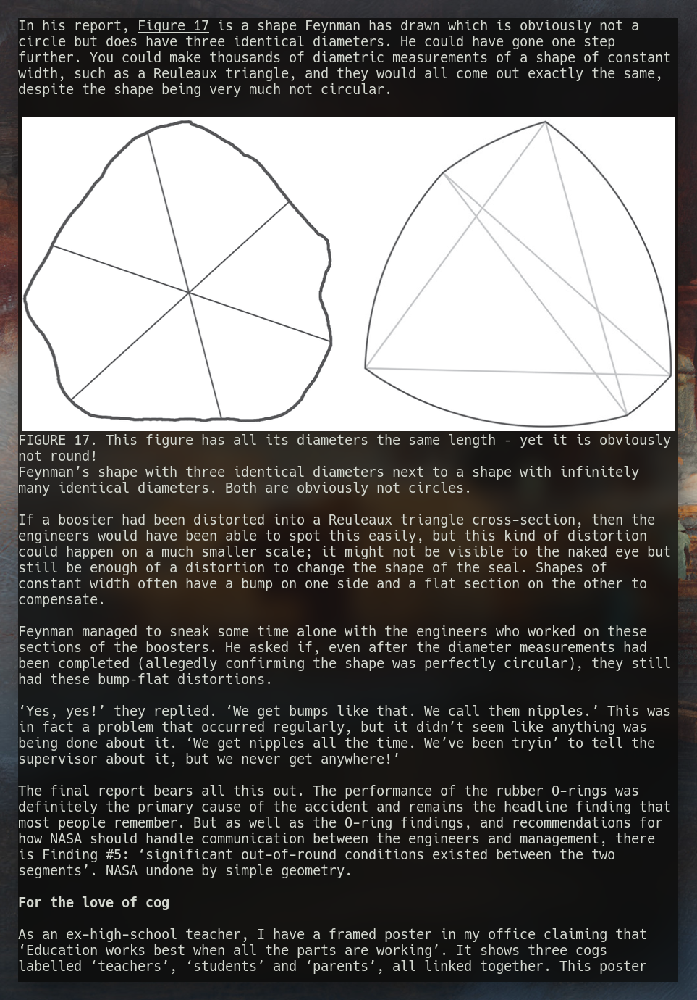

# nuber

Inspired by [epy](https://github.com/wustho/epy), *nuber* is an Epub terminal reader with inline images written with Rust and Python using [Überzug](https://github.com/seebye/ueberzug).



### Features
 - Display images in terminal.
 - Movement with vim keys `hjkl`.
 - Table of content navigation with `t`.
 - Dynamic window resize.
 - Rememebers last position per book.

### Installation
Requirements: `maturin`, `pip`
```sh
$ git clone https://github.com/mtshrmn/nuber.git --recursive && cd nuber
$ cd rust-html2text && git apply ../html2text.patch && cd ..
$ maturin build --release
$ pip install .
```

### Usage
```sh
$ nuber --help
Usage: nuber [OPTIONS] BOOK

Options:
  --help  Show this message and exit.
```

### Contribute
Requirements: `maturin`, `poetry`
```sh
$ git clone https://github.com/mtshrmn/nuber.git --recursive && cd nuber
$ cd rust-html2text && git apply ../html2text.patch && cd ..
$ poetry install && poetry shell
$ maturin develop && exit
$ poetry run nuber
```
